  

  

   

  

**Telescraperra** &nbsp;python · playwright · gemini · privado

Bot de Telegram que detecta tips de apuestas en texto e imagen con un 
clasificador de visión, localiza cada partido en Winamax con Playwright + 
Camoufox, monta el cupón, lo valida con IA contra el aviso original y lo 
deja esperando un clic humano.

> Es el proyecto en el que aprendí que la parte difícil no era el scraping, 
> sino decidir qué hace el sistema cuando no está seguro.

> **TelegramBot** &nbsp;python · telethon · gemini · sqlite 

> La primera parte de Telescraperra, y la única pública: escucha los grupos 
> seleccionados y manda cada mensaje entero —texto, captura o ambos— al 
> clasificador de visión, que decide él solo si hay un tip que todavía se 
> puede jugar. Lo que encuentra lo guarda en SQLite y lo avisa por un bot de 
> Telegram.

**ActionPrufe** &nbsp;python · playwright · gemini · mit

Librería que comprueba que cada acción de navegador hizo lo que pretendía. 
Compara el estado semántico de la página antes y después, y si el efecto no 
corresponde al elemento sobre el que se actuó, lo deshace y reintenta; si no 
puede deshacerlo, aborta en vez de seguir operando sobre una página que ya 
no es la que se creía.

> En una lista virtualizada, React recicla el nodo 
> entre que lo localizas y lo clicas, así que el clic no 
> da error y aun así añade otra cosa. Los healer agents reparan selectores 
> rotos; esto persigue el fallo contrario, el que no rompe nada.

Cómo está hecho, por dentro

GitHub limpia el HTML del README: fuera <samp>&lt;style&gt;</samp>, fuera 
<samp>style=""</samp>, fuera <samp>&lt;svg&gt;</samp> en línea y fuera 
cualquier script. Lo que no toca es el interior de un SVG servido como 
imagen, porque es otro documento. Así que todo el estilo y todo el 
movimiento viven ahí dentro.

El coche es una foto reducida a una rejilla de 160 columnas sobre una rampa 
de trece caracteres. Cada fila se dibuja dentro de un <samp>clipPath</samp> 
cuyo rectángulo crece de cero a su ancho en pasos discretos, con un cursor 
cabalgando el borde; las filas se escalonan de arriba abajo y todo termina 
con <samp>fill-mode: both</samp>, así que se escribe una vez y se queda 
quieto. Nada en esta página hace bucle.

La foto de la que sale es [un 190E 2.6 de 1987](https://commons.wikimedia.org/wiki/File:1987_Mercedes_Benz_190_E_(W201)_2.6_sedan_(24084486981).jpg) 
de Jeremy, de Sídney, [CC BY 2.0](https://creativecommons.org/licenses/by/2.0) vía Wikimedia Commons. Está en 
<samp>assets/portrait-source.jpg</samp>, y el dibujo se rehace con 
<samp>python scripts/build.py --portrait assets/portrait-source.jpg</samp>.

Lleva dos rampas. La estándar convierte lo oscuro en caracteres densos: 
correcto sobre fondo claro, y un negativo fotográfico sobre fondo oscuro, 
que es como se está viendo en realidad la mayoría de retratos ASCII de 
GitHub. Aquí se generan los dos mapeos y se conmutan con 
<samp>prefers-color-scheme</samp>.

La tipografía es JetBrains Mono incrustada en base64 dentro de cada archivo. 
Una URL externa no funcionaría: los navegadores no cargan subrecursos para 
documentos que son imágenes. Cada SVG lleva solo los glifos que usa — trece 
caracteres para el coche — y el total son 13 KB en lugar de los 4,5 MB que 
costaría incrustar la fuente entera en cada uno.

Las cifras salen de la API de GitHub con la ventana fijada a días UTC 
completos. Sin eso, «el último año» se mide desde el instante de la 
petición, dos ejecuciones separadas por minutos reparten los días en semanas 
distintas, y acabas con un commit sin sentido cada noche.

  Datos al 21/08/2026 · regenerado cada noche por <samp>.github/workflows/refresh.yml</samp> · sin dependencias de terceros

